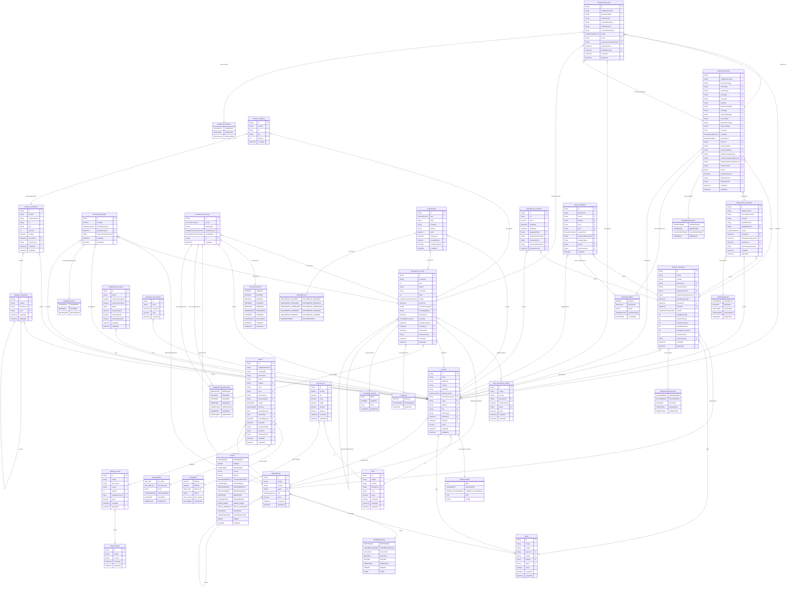

```mermaid
erDiagram

        TipoDocumento {
            DNI DNI
PASAPORTE PASAPORTE
CARNET_EXTRANJERIA CARNET_EXTRANJERIA
PTP PTP
OTRO OTRO
        }
    


        TipoDependencia {
            RECTORADO RECTORADO
VICERRECTORADO VICERRECTORADO
FACULTAD FACULTAD
ESCUELA ESCUELA
OFICINA OFICINA
DIRECCION DIRECCION
UNIDAD UNIDAD
OTRO OTRO
        }
    


        EstadoBien {
            NUEVO NUEVO
BUENO BUENO
REGULAR REGULAR
MALO MALO
MUY_MALO MUY_MALO
CHATARRA CHATARRA
        }
    


        SituacionBien {
            EN_USO EN_USO
EN_DESUSO EN_DESUSO
BAJA BAJA
TRANSFERIDO TRANSFERIDO
FALTANTE FALTANTE
SOBRANTE SOBRANTE
        }
    


        Modulo {
            DASHBOARD DASHBOARD
BIENES BIENES
INVENTARIO INVENTARIO
ALTAS ALTAS
BAJAS BAJAS
TRANSFERENCIAS TRANSFERENCIAS
CATEGORIAS CATEGORIAS
DEPENDENCIAS DEPENDENCIAS
RESPONSABLES RESPONSABLES
REPORTES REPORTES
DOCUMENTOS DOCUMENTOS
ADMIN_PANEL ADMIN_PANEL
ROLES_PERMISOS ROLES_PERMISOS
USUARIOS USUARIOS
CONFIGURACION CONFIGURACION
SEDES SEDES
TRAMITE TRAMITE
        }
    


        EstadoDocumentoTramite {
            BORRADOR BORRADOR
ENVIADO ENVIADO
RECIBIDO RECIBIDO
DERIVADO DERIVADO
OBSERVADO OBSERVADO
ATENDIDO ATENDIDO
ARCHIVADO ARCHIVADO
        }
    


        TipoFirma {
            DIGITAL DIGITAL
ESCANEADO ESCANEADO
NINGUNA NINGUNA
        }
    


        AccionDocumento {
            CREADO CREADO
EDITADO EDITADO
ENVIADO ENVIADO
RECIBIDO RECIBIDO
DERIVADO DERIVADO
OBSERVADO OBSERVADO
ATENDIDO ATENDIDO
ARCHIVADO ARCHIVADO
FIRMADO FIRMADO
ANULADO ANULADO
        }
    


        TipoNotificacion {
            DOCUMENTO_RECIBIDO DOCUMENTO_RECIBIDO
DOCUMENTO_DERIVADO DOCUMENTO_DERIVADO
DOCUMENTO_OBSERVADO DOCUMENTO_OBSERVADO
DOCUMENTO_ATENDIDO DOCUMENTO_ATENDIDO
DOCUMENTO_FIRMADO DOCUMENTO_FIRMADO
RECORDATORIO RECORDATORIO
        }
    


        PrioridadDocumento {
            BAJA BAJA
NORMAL NORMAL
ALTA ALTA
URGENTE URGENTE
        }
    


        EstadoRecepcion {
            PENDIENTE PENDIENTE
RECIBIDO RECIBIDO
RECHAZADO RECHAZADO
        }
    


        EstadoSesionInventario {
            PROGRAMADA PROGRAMADA
EN_PROCESO EN_PROCESO
PAUSADA PAUSADA
FINALIZADA FINALIZADA
CANCELADA CANCELADA
        }
    


        EstadoFisicoBien {
            BUENO BUENO
REGULAR REGULAR
MALO MALO
INOPERATIVO INOPERATIVO
CHATARRA CHATARRA
        }
    


        ResultadoVerificacion {
            ENCONTRADO ENCONTRADO
REUBICADO REUBICADO
NO_ENCONTRADO NO_ENCONTRADO
SOBRANTE SOBRANTE
        }
    


        EstadoAsignacion {
            PENDIENTE PENDIENTE
ENVIADO ENVIADO
ACEPTADO ACEPTADO
RECHAZADO RECHAZADO
CERRADO CERRADO
        }
    


        EstadoTransferencia {
            PENDIENTE PENDIENTE
ACEPTADA ACEPTADA
RECHAZADA RECHAZADA
        }
    
  "roles" {
    String id "🗝️"
    String codigo 
    String nombre 
    String descripcion "❓"
    String color 
    Boolean activo 
    Boolean esSistema 
    DateTime createdAt 
    DateTime updatedAt 
    }
  

  "usuarios" {
    String id "🗝️"
    String email 
    String password 
    String nombre 
    String apellidos 
    TipoDocumento tipoDocumento 
    String numeroDocumento "❓"
    String cargo "❓"
    String telefono "❓"
    String foto "❓"
    String fotoGoogle "❓"
    DateTime fechaInicio "❓"
    DateTime fechaFin "❓"
    Boolean activo 
    DateTime createdAt 
    DateTime updatedAt 
    }
  

  "configuracion_usuarios" {
    String id "🗝️"
    String theme 
    Boolean notificacionesEmail 
    Boolean notificacionesPush 
    String idioma 
    Boolean vistaCompacta 
    Boolean mostrarEstado 
    Boolean mostrarActividad 
    DateTime createdAt 
    DateTime updatedAt 
    }
  

  "password_reset_tokens" {
    String id "🗝️"
    String token 
    DateTime expiresAt 
    Boolean used 
    DateTime createdAt 
    }
  

  "dependencias" {
    String id "🗝️"
    String codigo 
    String nombre 
    String siglas "❓"
    TipoDependencia tipo 
    Boolean activo 
    DateTime createdAt 
    DateTime updatedAt 
    }
  

  "sedes" {
    String id "🗝️"
    String codigo 
    String nombre 
    String direccion "❓"
    String ciudad "❓"
    String telefono "❓"
    String email "❓"
    Boolean activo 
    DateTime createdAt 
    DateTime updatedAt 
    }
  

  "catalogo_bienes" {
    String id "🗝️"
    String codigo 
    String descripcion 
    String cuenta 
    Int vidaUtil "❓"
    Float tasaDepreciacion "❓"
    Boolean activo 
    DateTime createdAt 
    DateTime updatedAt 
    }
  

  "grupos_bienes" {
    String id "🗝️"
    String codigo 
    String nombre 
    DateTime createdAt 
    DateTime updatedAt 
    }
  

  "bienes" {
    String id "🗝️"
    String codigoPatrimonial 
    String codigoSBN "❓"
    String descripcion 
    String marca "❓"
    String modelo "❓"
    String serie "❓"
    String color "❓"
    String dimensiones "❓"
    String caracteristicas "❓"
    EstadoBien estado 
    SituacionBien situacion 
    Float valorAdquisicion "❓"
    Float valorActual "❓"
    DateTime fechaAdquisicion "❓"
    DateTime fechaAlta "❓"
    String documentoAlta "❓"
    String ubicacion "❓"
    String observaciones "❓"
    DateTime createdAt 
    DateTime updatedAt 
    }
  

  "permisos_rol" {
    String id "🗝️"
    Modulo modulo 
    Boolean ver 
    Boolean crear 
    Boolean editar 
    Boolean eliminar 
    Boolean reportes 
    DateTime createdAt 
    DateTime updatedAt 
    }
  

  "tipos_documento_tramite" {
    String id "🗝️"
    String codigo 
    String nombre 
    String descripcion "❓"
    Boolean requiereFirma 
    String prefijo "❓"
    Boolean activo 
    DateTime createdAt 
    DateTime updatedAt 
    }
  

  "documentos_tramite" {
    String id "🗝️"
    String correlativo 
    Int anio 
    String asunto 
    String contenido "❓"
    Int folios 
    EstadoDocumentoTramite estado 
    TipoFirma tipoFirma 
    String archivoFirmadoUrl "❓"
    String firmaDigitalData "❓"
    DateTime fechaFirma "❓"
    PrioridadDocumento prioridad 
    DateTime fechaDocumento 
    DateTime fechaEnvio "❓"
    DateTime fechaLimite "❓"
    String observaciones "❓"
    DateTime createdAt 
    DateTime updatedAt 
    }
  

  "documentos_destino" {
    String id "🗝️"
    Boolean esCopia 
    EstadoRecepcion estadoRecepcion 
    DateTime fechaRecepcion "❓"
    String observacionRecepcion "❓"
    DateTime createdAt 
    DateTime updatedAt 
    }
  

  "archivos_adjuntos" {
    String id "🗝️"
    String nombre 
    String url 
    String tipo 
    Int tamanio 
    DateTime createdAt 
    }
  

  "documentos_historial" {
    String id "🗝️"
    AccionDocumento accion 
    String descripcion "❓"
    EstadoDocumentoTramite estadoAnterior "❓"
    EstadoDocumentoTramite estadoNuevo "❓"
    String ip "❓"
    DateTime createdAt 
    }
  

  "notificaciones" {
    String id "🗝️"
    TipoNotificacion tipo 
    String titulo 
    String mensaje 
    String enlace "❓"
    Boolean leido 
    DateTime fechaLeido "❓"
    Boolean enviadoEmail 
    DateTime fechaEnvioEmail "❓"
    DateTime createdAt 
    }
  

  "carpetas_repositorio" {
    String id "🗝️"
    String nombre 
    String descripcion "❓"
    String color "❓"
    DateTime createdAt 
    DateTime updatedAt 
    }
  

  "archivos_repositorio" {
    String id "🗝️"
    String nombre 
    String nombreArchivo 
    String url 
    String tipo 
    Int tamanio 
    Boolean firmado 
    DateTime fechaFirma "❓"
    String hashArchivo "❓"
    DateTime createdAt 
    DateTime updatedAt 
    }
  

  "sesiones_inventario" {
    String id "🗝️"
    String codigo 
    String nombre 
    String descripcion "❓"
    String ubicacionFisica "❓"
    String sigaCentroCosto "❓"
    String sigaNombreDependencia "❓"
    DateTime fechaProgramada 
    DateTime fechaInicio "❓"
    DateTime fechaFin "❓"
    EstadoSesionInventario estado 
    Int totalBienesSiga 
    Int totalVerificados 
    Int totalEncontrados 
    Int totalReubicados 
    Int totalNoEncontrados 
    Int totalSobrantes 
    String observaciones "❓"
    DateTime createdAt 
    DateTime updatedAt 
    }
  

  "participantes_inventario" {
    String id "🗝️"
    String rol 
    Boolean activo 
    DateTime createdAt 
    DateTime updatedAt 
    String agregadoPorId "❓"
    String agregadoPorNombre "❓"
    String removidoPorId "❓"
    String removidoPorNombre "❓"
    DateTime fechaRemovido "❓"
    }
  

  "asignaciones_inventario" {
    String id "🗝️"
    String tipoDocumento 
    String numeroDocumento 
    String nombres 
    String apellidoPaterno 
    String apellidoMaterno "❓"
    EstadoAsignacion estado 
    DateTime fechaEnvio "❓"
    DateTime fechaRespuestaUsuario "❓"
    DateTime fechaCierre "❓"
    String observacionesUsuario "❓"
    DateTime createdAt 
    DateTime updatedAt 
    }
  

  "verificaciones_bien" {
    String id "🗝️"
    String codigoPatrimonial 
    String descripcionSiga "❓"
    String marcaSiga "❓"
    String modeloSiga "❓"
    String serieSiga "❓"
    String colorSiga "❓"
    String tipoSiga "❓"
    String dimensionesSiga "❓"
    String otrosSiga "❓"
    String responsableSiga "❓"
    String usuarioSiga "❓"
    String dependenciaSiga "❓"
    String ubicacionSiga "❓"
    Float valorSiga "❓"
    ResultadoVerificacion resultado 
    EstadoFisicoBien estadoFisico "❓"
    String situacion "❓"
    String ubicacionReal "❓"
    String responsableReal "❓"
    String dniResponsableActual "❓"
    String nombresResponsableActual "❓"
    String apellidosResponsableActual "❓"
    String observaciones "❓"
    String fotoUrl "❓"
    DateTime fechaVerificacion 
    String dispositivoTipo "❓"
    String dispositivoInfo "❓"
    DateTime createdAt 
    DateTime updatedAt 
    }
  

  "transferencias_bien" {
    String id "🗝️"
    String codigoPatrimonial 
    String descripcionBien "❓"
    String dniRemitente 
    String nombreRemitente 
    String dniDestinatario 
    String nombreDestinatario 
    EstadoTransferencia estado 
    String motivo "❓"
    String observacionesDestinatario "❓"
    DateTime fechaSolicitud 
    DateTime fechaRespuesta "❓"
    DateTime createdAt 
    DateTime updatedAt 
    }
  

  "bienes_sobrantes" {
    String id "🗝️"
    String descripcion 
    String marca "❓"
    String modelo "❓"
    String serie "❓"
    String color "❓"
    EstadoFisicoBien estadoFisico "❓"
    String ubicacionEncontrado "❓"
    String codigoAntiguo "❓"
    String fotoUrl "❓"
    String observaciones "❓"
    DateTime createdAt 
    }
  
    "usuarios" |o--|| "TipoDocumento" : "enum:tipoDocumento"
    "usuarios" }o--|| roles : "rol"
    "usuarios" }o--|o sedes : "sede"
    "usuarios" }o--|o dependencias : "dependencia"
    "configuracion_usuarios" |o--|| usuarios : "user"
    "password_reset_tokens" }o--|| usuarios : "user"
    "dependencias" |o--|| "TipoDependencia" : "enum:tipo"
    "dependencias" }o--|| sedes : "sede"
    "dependencias" |o--|o dependencias : "parent"
    "catalogo_bienes" }o--|o grupos_bienes : "grupo"
    "bienes" |o--|| "EstadoBien" : "enum:estado"
    "bienes" |o--|| "SituacionBien" : "enum:situacion"
    "bienes" }o--|o catalogo_bienes : "catalogo"
    "bienes" }o--|o dependencias : "dependencia"
    "permisos_rol" }o--|| roles : "rol"
    "permisos_rol" |o--|| "Modulo" : "enum:modulo"
    "documentos_tramite" }o--|| tipos_documento_tramite : "tipoDocumento"
    "documentos_tramite" }o--|| dependencias : "dependenciaOrigen"
    "documentos_tramite" }o--|| usuarios : "remitente"
    "documentos_tramite" |o--|| "EstadoDocumentoTramite" : "enum:estado"
    "documentos_tramite" |o--|| "TipoFirma" : "enum:tipoFirma"
    "documentos_tramite" |o--|| "PrioridadDocumento" : "enum:prioridad"
    "documentos_tramite" |o--|o documentos_tramite : "documentoReferencia"
    "documentos_destino" }o--|| documentos_tramite : "documento"
    "documentos_destino" }o--|| dependencias : "dependenciaDestino"
    "documentos_destino" }o--|o usuarios : "destinatario"
    "documentos_destino" |o--|| "EstadoRecepcion" : "enum:estadoRecepcion"
    "documentos_destino" }o--|o usuarios : "receptor"
    "archivos_adjuntos" }o--|| documentos_tramite : "documento"
    "archivos_adjuntos" }o--|o archivos_repositorio : "archivoRepositorio"
    "documentos_historial" }o--|| documentos_tramite : "documento"
    "documentos_historial" |o--|| "AccionDocumento" : "enum:accion"
    "documentos_historial" }o--|| usuarios : "usuario"
    "documentos_historial" }o--|o dependencias : "dependencia"
    "documentos_historial" |o--|o "EstadoDocumentoTramite" : "enum:estadoAnterior"
    "documentos_historial" |o--|o "EstadoDocumentoTramite" : "enum:estadoNuevo"
    "notificaciones" }o--|| usuarios : "usuario"
    "notificaciones" }o--|o documentos_tramite : "documento"
    "notificaciones" |o--|| "TipoNotificacion" : "enum:tipo"
    "carpetas_repositorio" }o--|| usuarios : "usuario"
    "carpetas_repositorio" |o--|o carpetas_repositorio : "parent"
    "archivos_repositorio" }o--|| usuarios : "usuario"
    "archivos_repositorio" }o--|o carpetas_repositorio : "carpeta"
    "sesiones_inventario" }o--|o dependencias : "dependencia"
    "sesiones_inventario" }o--|o sedes : "sede"
    "sesiones_inventario" |o--|| "EstadoSesionInventario" : "enum:estado"
    "sesiones_inventario" }o--|| usuarios : "responsable"
    "participantes_inventario" }o--|| sesiones_inventario : "sesion"
    "participantes_inventario" }o--|| usuarios : "usuario"
    "asignaciones_inventario" }o--|| sesiones_inventario : "sesion"
    "asignaciones_inventario" }o--|o usuarios : "usuario"
    "asignaciones_inventario" |o--|| "EstadoAsignacion" : "enum:estado"
    "verificaciones_bien" }o--|| sesiones_inventario : "sesion"
    "verificaciones_bien" }o--|o asignaciones_inventario : "asignacion"
    "verificaciones_bien" |o--|| "ResultadoVerificacion" : "enum:resultado"
    "verificaciones_bien" |o--|o "EstadoFisicoBien" : "enum:estadoFisico"
    "verificaciones_bien" }o--|| usuarios : "verificador"
    "transferencias_bien" }o--|| verificaciones_bien : "verificacion"
    "transferencias_bien" }o--|o usuarios : "remitente"
    "transferencias_bien" }o--|o usuarios : "destinatario"
    "transferencias_bien" }o--|o verificaciones_bien : "verificacionDestino"
    "transferencias_bien" }o--|o documentos_tramite : "documentoActa"
    "transferencias_bien" |o--|| "EstadoTransferencia" : "enum:estado"
    "bienes_sobrantes" }o--|| sesiones_inventario : "sesion"
    "bienes_sobrantes" |o--|o "EstadoFisicoBien" : "enum:estadoFisico"
    "bienes_sobrantes" }o--|| usuarios : "registradoPor"
```
